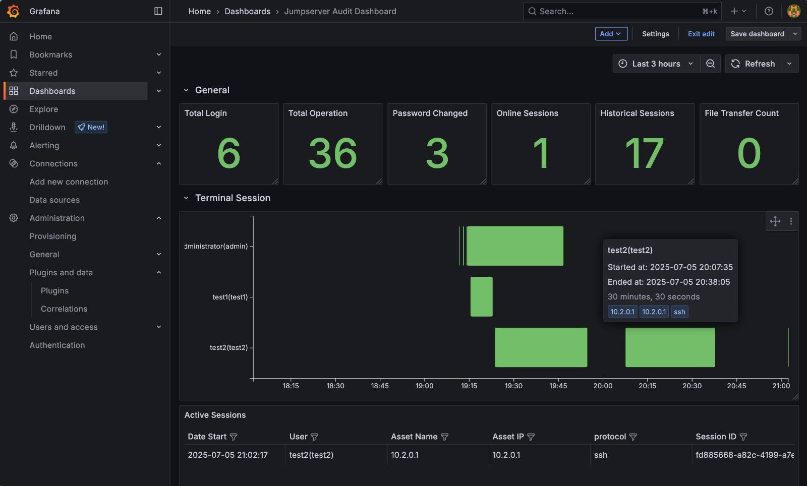
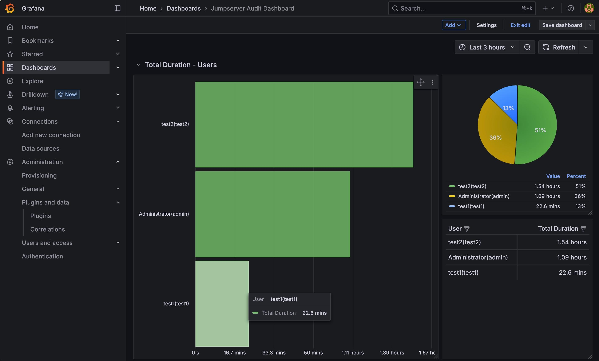
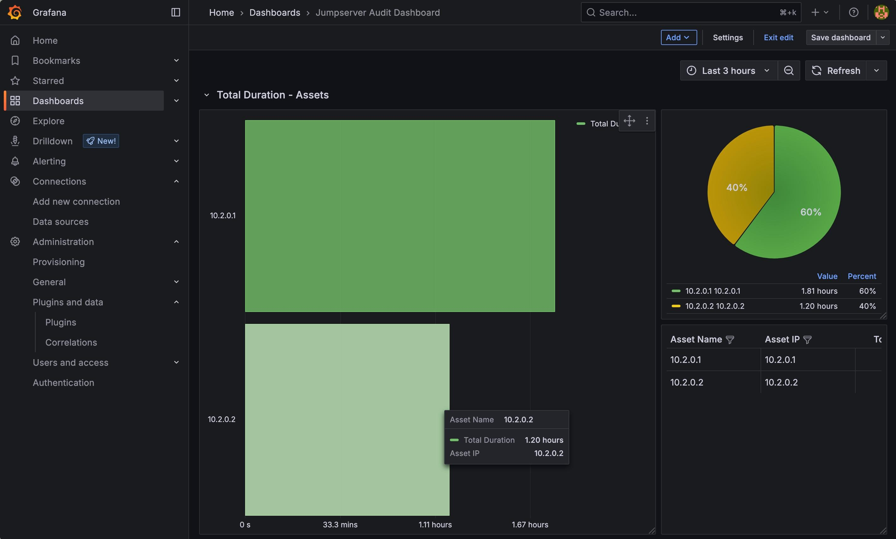
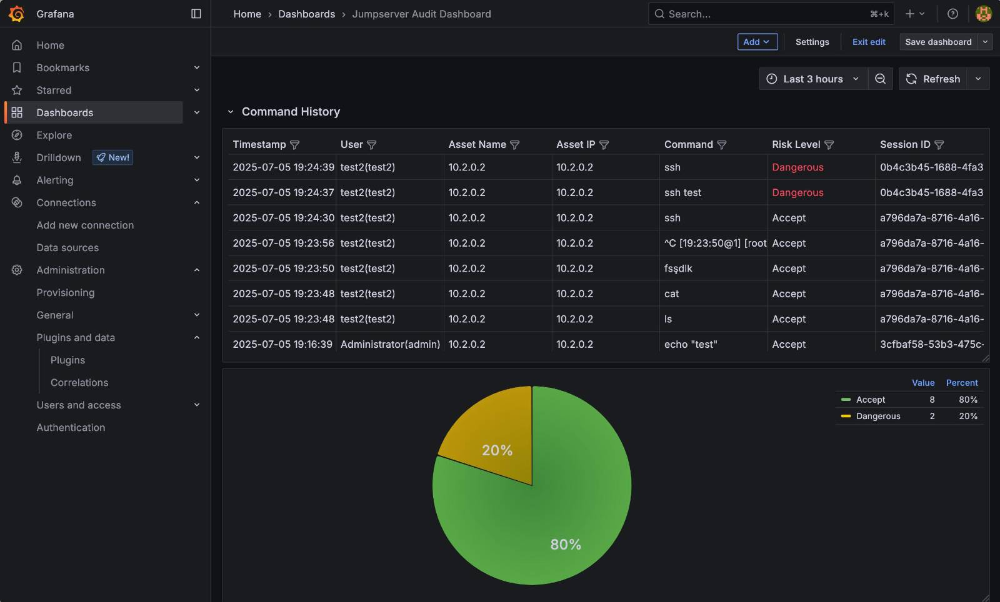
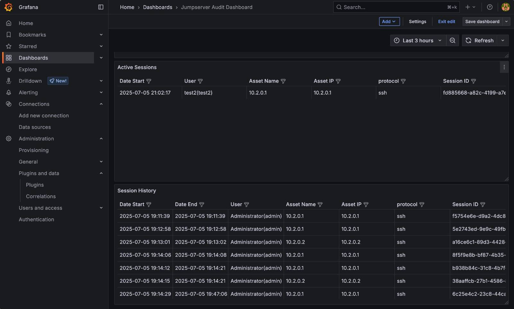

# Jumpserver Audit Dashboard for Grafana

This project provides a ready-to-use Grafana dashboard and automation scripts for auditing Jumpserver environments. It supports both MySQL and PostgreSQL backends and offers comprehensive visualizations of user activity, session history, command risk, and more.

## Features
- **Automated Grafana setup** via shell scripts
- **Dashboard import** for both MySQL and PostgreSQL
- **Jumpserver database integration**
- **User/session/command analytics**
- **Risk classification and visualizations**
- **Example screenshots included**

---

## Dashboard Overview

The dashboard provides:
- **General stats:** Logins, operations, password changes, sessions, file transfers
- **Session analytics:** Active/historical sessions, durations by user/asset
- **Command history:** Risk classification, command breakdown
- **Visualizations:** Gantt charts, bar charts, pie charts, tables

---

## Example Screenshots

Below are example screenshots from the dashboard (see `img/`):











---

## Folder Structure
```
├── grafanactl.sh                        # Grafana container control script
├── quick_start.sh                       # One-shot setup and dashboard import
├── jumpserver-audit-dashboard-mysql.json      # Dashboard (MySQL)
├── jumpserver-audit-dashboard-postgresql.json # Dashboard (PostgreSQL)
├── .example.env                         # Example environment config
├── img/                                 # Example screenshots
│   ├── jms_grafana_1.jpeg
│   ├── jms_grafana_3.jpeg
│   ├── jms_grafana_4.jpeg
│   ├── jms_grafana_5.jpeg
│   └── jsm_grafana_2.jpeg
```

---

## Prerequisites
- Docker
- Jumpserver instance (with MySQL or PostgreSQL backend)
- Bash shell
- [jq](https://stedolan.github.io/jq/) (for JSON processing)

---

## Quick Start

1. **Copy and configure environment:**
   ```sh
   cp .example.env .env
   # Edit .env to match your environment (see below)
   ```

2. **Edit `.env` variables:**
   - `GRAFANA_VERSION` (default: 10.2.3)
   - `GRAFANA_PORT` (default: 3000)
   - `NETWORK_NAME` (Docker network, e.g. `jms_net`)
   - `GRAFANA_CONTAINER_NAME` (default: `grafana`)
   - `GRAFANA_ADMIN_USER` / `GRAFANA_ADMIN_PASSWORD`
   - `JS_CONFIG_PATH` (path to Jumpserver's `config.txt`)

3. **Run the quick start script:**
   ```sh
   ./quick_start.sh
   ```
   This will:
   - Start Grafana in Docker
   - Add the Jumpserver database as a data source
   - Import the appropriate dashboard (MySQL or PostgreSQL)

4. **Access Grafana:**
   - Open [http://localhost:3000](http://localhost:3000) (or your configured port)
   - Login with the credentials from `.env`

---

## Manual Control

Use `grafanactl.sh` for advanced container management:

```sh
./grafanactl.sh start        # Start Grafana
./grafanactl.sh stop         # Stop Grafana
./grafanactl.sh restart      # Restart Grafana
./grafanactl.sh status       # Show container status
./grafanactl.sh logs         # Tail Grafana logs
./grafanactl.sh shell        # Open shell in Grafana container
./grafanactl.sh delete_all   # Full cleanup
```

---

## Environment File Example

`.env` example:
```env
GRAFANA_VERSION=10.2.3
GRAFANA_PORT=3000
NETWORK_NAME=jms_net
GRAFANA_CONTAINER_NAME=grafana
GRAFANA_ADMIN_USER=admin
GRAFANA_ADMIN_PASSWORD=admin
JS_CONFIG_PATH=/opt/jumpserver/config/config.txt
```

---

## Notes
- The dashboard JSON files are tailored for Jumpserver's schema.
- The scripts will auto-detect your DB type and import the correct dashboard.
- For troubleshooting, check container logs: `./grafanactl.sh logs`

---

## License

Licensed to acerrah under The GNU General Public License version 3 (GPLv3) (the "License"); you may not use this file except in compliance with the License. You may obtain a copy of the License at:

https://www.gnu.org/licenses/gpl-3.0.html

Unless required by applicable law or agreed to in writing, software distributed under the License is distributed on an "AS IS" BASIS, WITHOUT WARRANTIES OR CONDITIONS OF ANY KIND, either express or implied. See the License for the specific language governing permissions and limitations under the License.